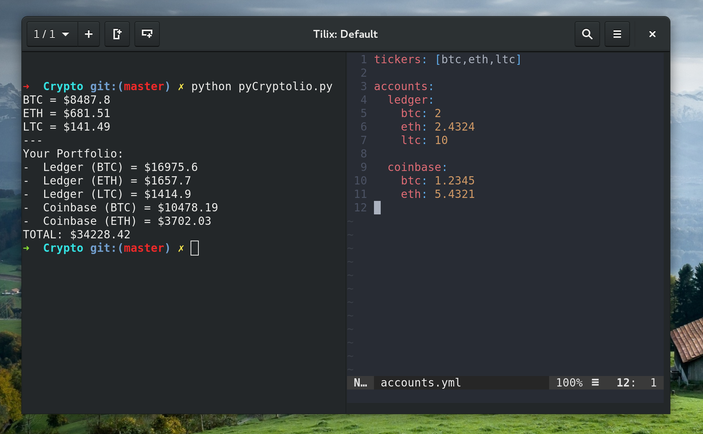

pyCryptolio
---

Simple Python script that will show you the value of your portfolio in US dollars.

Uses the Kraken exchange to get prices by default but you can easily change this.



## Installation

You will need [ccxt](https://github.com/ccxt/ccxt), the library used to get cryptocurrency prices.

`pip install ccxt`

## Usage

Create an `accounts.yml` file. (See `accounts-example.yml` as a starting point.)

To run the program, run `python pyCryptolio.py`

## Use a different exchange

You can pull data from different exchanges by creating an `exchange` value in `accounts.yml`.

For example, to use bitfinex.com, put the following in `accounts.yml`.

```
exchange: 'bitfinex'
```

[Go here](https://github.com/ccxt/ccxt) for a list of exchanges. The name you would want to specify in `accounts.yml` is under the `id` column of the table on that page.
